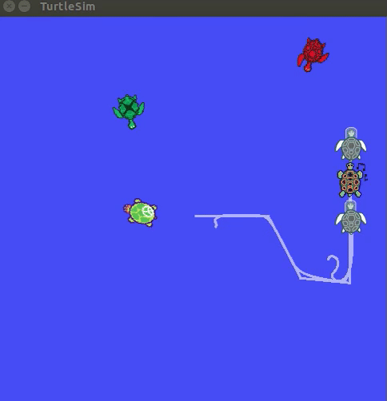

# Turtle Snake

This repository contains the code for `turtlesnake` package which is the implementation of classic snake game for Robot Operating System (ROS) using turtlesim.



<br/>

## Usage

* Install `turtlesnake` package clone this into `catkin_ws/src` folder.

```console
device:/home/user/catkin_ws/src$ git clone https://github.com/saksham2001/turtlesnake.git
```

* Build `catkin_ws` 

```console
device:/home/user/catkin_ws$ catkin_make
```

* Run the package by using the command

```console
device:/home/user/catkin_ws$ roslaunch turtlesnake turtlesnanke.launch
```

**Note:**
* Move the turtle around by using Arrow Keys
* Kill the program using `ctrl+c`

### Project Video
[](https://youtu.be/KxFaE65lG08)
